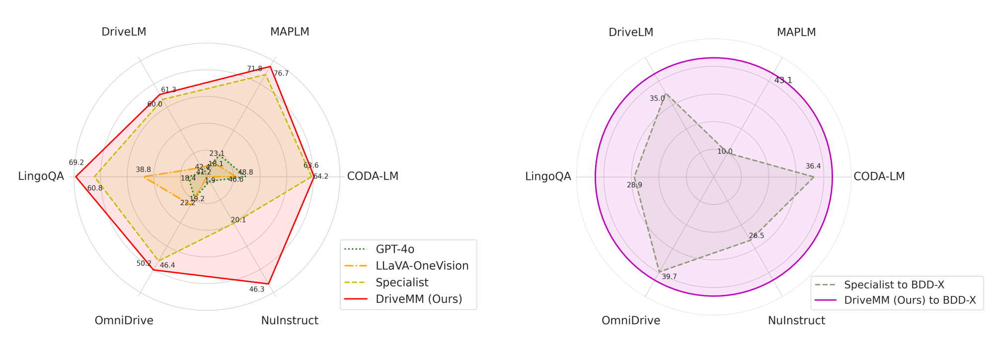

# DriveMM: All-in-One Large Multimodal Model for Autonomous Driving
[]() 
[](https://zhijian11.github.io/DriveMM/) 


This repository contains the implementation of the paper:

> DriveMM: All-in-One Large Multimodal Model for Autonomous Driving <br>
> [Zhijian Huang](https://zhijian11.github.io/)\*, [Chenjian Feng](https://fcjian.github.io/)\*, [Fen Yan](https://scholar.google.com.hk/citations?user=gO4divAAAAAJ&hl=zh-CN&oi=sra), [Baihui Xiao](hxbh23@mails.tsinghua.edu.cn), [Zequn Jie](https://scholar.google.com/citations?user=4sKGNB0AAAAJ&hl=zh-CN&oi=ao), [Yujie Zhong](https://y-zhong.info/), [Xiaodan liang](https://lemondan.github.io/)†, [Lin Ma](http://forestlinma.com/)† <br>
> *Equal Contribution   †Corresponding Authors

<p align="center" style="background-color: white;">
  
</p>

## :fire: Updates
- **2024.12**: We release DriveMM paper on arxiv！We release the models and inference code!

## :sparkles: Hightlights
🔥 We propose a novel all-in-one large multimodal model, **DriveMM**, robustly equipped with the general capabilities to execute a wide range of AD tasks and the generalization ability to effectively transfer to new datasets.
<p align="center" style="background-color: white;">
  
</p>
🔥 We introduce comprehensive benchmarks for evaluating autonomous driving LMMs, which include six public datasets, four input types, and thirteen challenging tasks. To the best of our knowledge, this is the first to use multiple benchmarks to evaluate autonomous driving LLMs.
<p align="center" style="background-color: white;">
  
</p>
🔥 We present a curriculum principle for pre-training and fine-tuning on both diverse multimodal data and AD
data. DriveMM demonstrates state-of-the-art performances and consistently outperforms models trained on the individual dataset across all evaluated benchmarks.


## :checkered_flag: Getting Started

### Installation

#### 1. **Clone this repository and navigate to the DriveMM folder:**
```bash
git clone https://github.com/zhijian11/DriveMM
cd DriveMM
```
#### 2. **Install the inference package:**
```bash
conda create -n drivemm python=3.10 -y
conda activate drivemm
pip install --upgrade pip  # Enable PEP 660 support.
pip install -e ".[train]"
```
#### 3. **Inference DriveMM demo:**
- Download the [checkpoint](https://huggingface.co/DriveMM/DriveMM/tree/main) and put them on ckpt/ floder.
```bash
cd scripts/inference_demo
python demo_image.py # for image input 
python demo_video.py # for video input
```
## :white_check_mark: TODO
- [x] DriveMM models
- [x] DriveMM inference code
- [ ] DriveMM evaluation code
- [ ] DriveMM training data
- [ ] DriveMM training code


## :blush: Acknowledge
This project has referenced some excellent open-sourced repos([LLaVa-NeXT](https://github.com/LLaVA-VL/LLaVA-NeXT/tree/main)). Thanks for their wonderful works and contributions to the community.
<!-- ([Detectron2](https://github.com/facebookresearch/detectron2), [detrex](https://github.com/IDEA-Research/detrex), [GLIP](https://github.com/microsoft/GLIP), [G-DINO](https://github.com/IDEA-Research/GroundingDINO), [YOLO-World](https://github.com/AILab-CVC/YOLO-World)).  -->


## :pushpin: Citation
If you find DriveMM is helpful for your research or applications, please consider giving us a star 🌟 and citing it by the following BibTex entry.

<!-- ```bibtex
@article{wang2024ovdino,
  title={OV-DINO: Unified Open-Vocabulary Detection with Language-Aware Selective Fusion}, 
  author={Hao Wang and Pengzhen Ren and Zequn Jie and Xiao Dong and Chengjian Feng and Yinlong Qian and Lin Ma and Dongmei Jiang and Yaowei Wang and Xiangyuan Lan and Xiaodan Liang},
  journal={arXiv preprint arXiv:2407.07844},
  year={2024}
} -->
```